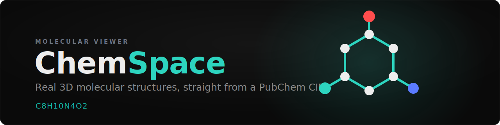

<p align="center">
  
</p>

<p align="center">
  
  
  
</p>

# ChemSpace

Search for a compound and ChemSpace shows you the molecule the way it actually sits in space: an
interactive 3D ball-and-stick model you can orbit, spin, and inflate into a space-filling blob,
wrapped in a dark compound-detail page with its identifiers and a little visual readout of its
properties.

It started as a weekend experiment and turned into the thing I bring to the LCSB bioinformatics
core group's monthly idea-sharing meeting, one small increment at a time.

## What it does

- **Real 3D structures, not flat diagrams.** Most compound pages show you a 2D sketch. ChemSpace
  pulls the actual 3D conformer and renders it as CPK-colored atoms and bonds you can look at from
  any angle.
- **Search however you think of it.** Type a compound name, a SMILES string, or a bare PubChem CID;
  it resolves to the right compound. Every molecule also has a shareable link (`?cid=2519`) that
  opens straight to it.
- **Ball-and-stick or space-filling.** Toggle between the two classic representations. Bonds fade
  out in space-filling mode, where they would just be noise.
- **Hover to identify, click to measure.** Point at any atom or bond to see what it is; flip on
  Measure and click atoms to read off a bond distance, a valence angle, or a torsion, straight from
  the real coordinates.
- **The numbers that matter.** A side panel lists the formula, mass, XLogP, SMILES, InChI, and the
  rest, with a link back out to the compound's PubChem page.
- **A property radar.** Instead of a plain table, the computed descriptors (molecular weight,
  XLogP, TPSA, H-bond donors and acceptors, rotatable bonds) are drawn as a ring of bars, each
  normalized to a typical small-molecule range. The value list underneath doubles as the accessible
  table view.
- **Small touches.** A first-load splash where a molecule assembles and tumbles, a camera that
  frames each new structure automatically, ambient occlusion and a soft bloom so the model reads
  with real depth, and animation that leans on GSAP so it feels designed rather than bolted on.

## How it works

There is no database and no build-time data step. Everything is fetched live from
[PubChem PUG REST](https://pubchem.ncbi.nlm.nih.gov/docs/pug-rest) when you enter a CID:

- The **3D structure** comes from the SDF record (`record_type=3d`), parsed straight out of the
  column-based MOL V2000 format, centered on its centroid, and measured so the camera knows how far
  back to sit. If a compound has no 3D conformer, it falls back to the flat 2D layout and says so.
- The **identifiers and descriptors** come from the property endpoint, best-effort: a compound
  missing a value still renders fine.

In development, calls go through a small Vite proxy so the browser talks to PubChem same-origin and
sidesteps CORS.

Performance is a feature here, not an afterthought. A whole molecule is **two draw calls**: one
instanced mesh for every atom and one for every bond, regardless of how many there are. Animation
never runs through React state, so the render loop stays at 60fps. Molecules today are small, so
this is really headroom for the bigger structures (proteins, assemblies) I want to load later.

## Getting started

```bash
npm install
npm run dev
```

Then open the local URL Vite prints. Search by name (try `caffeine`), a SMILES string, or a CID
(`2519`), or click one of the example chips.

```bash
npm run build   # typechecks, then builds for production
```

Heads-up: the PubChem proxy only exists in the dev server. A production deploy needs its own proxy
or a CORS-friendly data host.

## Tech

React + TypeScript on Vite, [react-three-fiber](https://github.com/pmndrs/react-three-fiber) and
[drei](https://github.com/pmndrs/drei) for the Three.js scenes,
[postprocessing](https://github.com/pmndrs/react-postprocessing) for the ambient occlusion and
bloom, [GSAP](https://gsap.com/) for animation, [Zustand](https://github.com/pmndrs/zustand) for
state, and Tailwind for the UI around the canvas.

## Where it's going

The focus now is speed. ChemSpace is deliberately a single page, the compound page, that you reach
by searching, and the goal is for it to feel instant: text on screen immediately, the 3D streaming
in behind it, and near-zero cost when a molecule is just sitting there. Next up:

- On-demand rendering, so an idle molecule uses no GPU
- Splitting the heavy 3D out of the initial load, and caching compounds you have already opened
- A lighter, SVG property radar in place of the second WebGL canvas
- A 2D depiction toggle, and quick druglikeness flags (Lipinski, Veber, QED)

Deliberately out of scope, to keep it fast and light: proteins, molecular surfaces, and multi-
molecule comparison. This is a fast viewer for one small molecule at a time, not a data platform.

## A note

This is a personal, for-fun project I work on in my own time. The concept and dark theme are modeled
on a [PubChemLite](https://pubchemlite.lcsb.uni.lu/) compound page. Structure and property data are
from PubChem, and thanks to them for the open API that makes the whole thing possible.
